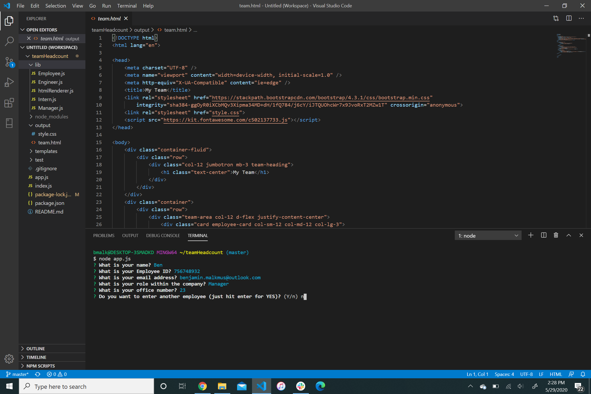
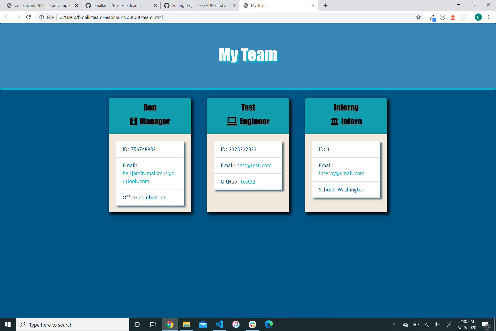

# teamHeadcount
Interactive CLI to enter an employee roster. 
## Description
Here is an employee roster page created using node.js. Open up your terminal and type "npm install" to install the packages onto your local computer (Jest and Inquirer). Once the package is installed, run "node app.js" on your terminal. You will be prompted a series of questions about each employee and their role. You can enter as many employees as you wish. Once finsihed with your inputs, a teams.html file will be generated into the output folder provided. Provided team.html in output folder is sample finished html file.

## Contact
Please contact me at benjamin.malkmus@outlook.com for any support issues.
## Acknowledgment
I would like to thank of all my teachers and TAs at University of Washington's Coding Bootcamp.  
inquirer npm  
jest npm  

## Deployment
https://bmalkmus.github.io/teamHeadcount

## Screenshots 
Data Entry 

  
Data Output 

## License
[MIT](https://choosealicense.com/licenses/mit/)
